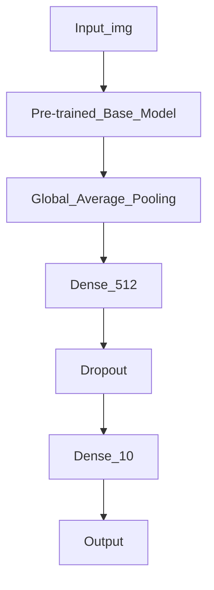

# Goat Classification AI System 🐐

A comprehensive machine learning system for analyzing and classifying different breeds of goats using deep learning.

## Features

- **Deep Learning Classification** - Uses transfer learning with pre-trained models (ResNet50, EfficientNetB0, MobileNetV2)
- **Multiple Goat Breeds** - Supports 10 different goat breed classifications
- **Data Augmentation** - Automatic image augmentation for better training
- **Model Evaluation** - Comprehensive evaluation metrics including accuracy, precision, and recall
- **Batch Prediction** - Process multiple images at once
- **Visualization** - Generate prediction results with visualization

## Supported Goat Breeds

1. Alpine
2. Angora
3. Boer
4. Cashmere
5. Dairy Goat
6. Nigerian Dwarf
7. Nubian
8. Saanen
9. Spanish
10. Unknown (for unclassified images)

## Project Structure

```
ai-classiffi/
├── data/
│   ├── training_images/     # Training data (organize by breed)
│   └── test_images/         # Test images for inference
├── models/                  # Trained model files
├── output/                  # Output results and visualizations
├── src/
│   ├── config.py           # Configuration settings
│   ├── data_loader.py      # Data loading and preprocessing
│   ├── model.py            # Model architecture and training
│   ├── classifier.py       # Main classification system
│   └── main.py             # Entry point
├── requirements.txt         # Python dependencies
└── README.md               # This file
```

## Installation

1. Clone or download this repository:
```bash
cd ai-classiffi
```

2. Create a virtual environment (recommended):
```bash
python -m venv venv
source venv/bin/activate  # On Windows: venv\Scripts\activate
```

3. Install dependencies:
```bash
pip install -r requirements.txt
```

## Data Preparation

Before training, organize your goat images in the following structure:

```
data/training_images/
├── Alpine/
│   ├── image1.jpg
│   ├── image2.jpg
│   └── ...
├── Angora/
│   ├── image1.jpg
│   ├── image2.jpg
│   └── ...
├── Boer/
│   └── ...
└── ... (other breeds)
```

Supported image formats: `.jpg`, `.jpeg`, `.png`, `.bmp`

## Usage

### Basic Training

```python
from src.classifier import GoatClassificationSystem

# Initialize system
system = GoatClassificationSystem()

# Train from directory
system.train_from_directory('data/training_images', augment=True)

# Save model
system.save_model()
```

### Making Predictions

```python
from src.classifier import GoatClassificationSystem

# Load system
system = GoatClassificationSystem()
system.load_model()

# Predict single image
breed, confidence, predictions = system.predict_image('path/to/image.jpg')
print(f"Breed: {breed}, Confidence: {confidence*100:.2f}%")

# Batch prediction
results = system.predict_batch('data/test_images')
for result in results:
    print(f"{result['image']}: {result['predicted_breed']} ({result['confidence']*100:.2f}%)")
```

### Run from Command Line

```bash
cd src
python main.py
```

## Configuration

Edit `src/config.py` to customize:

- **IMAGE_SIZE**: Input image dimensions (default: 224x224)
- **BATCH_SIZE**: Training batch size (default: 32)
- **EPOCHS**: Number of training epochs (default: 50)
- **LEARNING_RATE**: Model learning rate (default: 0.001)
- **PRETRAINED_MODEL**: Base architecture (resnet50, efficientnetb0, mobilenetv2)
- **AUGMENTATION_ENABLED**: Enable/disable data augmentation
- **CONFIDENCE_THRESHOLD**: Minimum confidence for predictions (default: 0.7)

## Model Architecture

The system uses a transfer learning approach:

1. **Base Model**: Pre-trained on ImageNet
2. **Feature Extraction**: Global average pooling
3. **Dense Layers**: Two fully connected layers with dropout
4. **Output**: Softmax layer for multi-class classification

```
Input (224x224x3)
    ↓
Pre-trained Base Model (ResNet50/EfficientNetB0/MobileNetV2)
    ↓
Global Average Pooling
    ↓
Dense(512) + ReLU
    ↓
Dropout(0.3)
    ↓
Dense(256) + ReLU
    ↓
Dropout(0.3)
    ↓
Dense(10) + Softmax
    ↓
Output (10 classes)
```

## Diagrame 


## Training Options

### Standard Training
```python
system.train_from_directory('data/training_images', augment=False)
```

### Training with Data Augmentation
```python
system.train_from_directory('data/training_images', augment=True)
```

### Fine-tuning
```python
# After initial training
system.classifier.unfreeze_base_layers(num_layers=50)
system.train_from_directory('data/training_images')
```

## Performance Metrics

The model is evaluated on:
- **Accuracy**: Percentage of correct predictions
- **Precision**: Accuracy of positive predictions
- **Recall**: Ability to find all positive cases
- **Loss**: Categorical cross-entropy loss

## Output Files

The system generates:
- **models/goat_classifier_v1.h5**: Trained model
- **output/**: Prediction results and visualizations

## Troubleshooting

### No images found
- Ensure images are in correct directory structure
- Check supported formats (.jpg, .jpeg, .png, .bmp)

### Memory issues
- Reduce BATCH_SIZE in config.py
- Use smaller IMAGE_SIZE
- Use MobileNetV2 (lighter model)

### Poor accuracy
- Increase training data quantity
- Enable data augmentation
- Try different base models
- Increase EPOCHS
- Adjust LEARNING_RATE

## Requirements

- Python 3.8+
- TensorFlow 2.14.0+
- Keras 2.14.0+
- NumPy, Pandas, OpenCV
- scikit-learn, Pillow

## Future Enhancements

- [ ] Real-time video prediction
- [ ] Model quantization for mobile deployment
- [ ] Web interface for predictions
- [ ] REST API
- [ ] Support for more goat breeds
- [ ] Ensemble learning with multiple models

## License

MIT License - Free for educational and commercial use

## Support

For issues, improvements, or suggestions, please create an issue or contribute to the project.

---

**Created with ❤️ for goat classification**
# ai-goat-app
